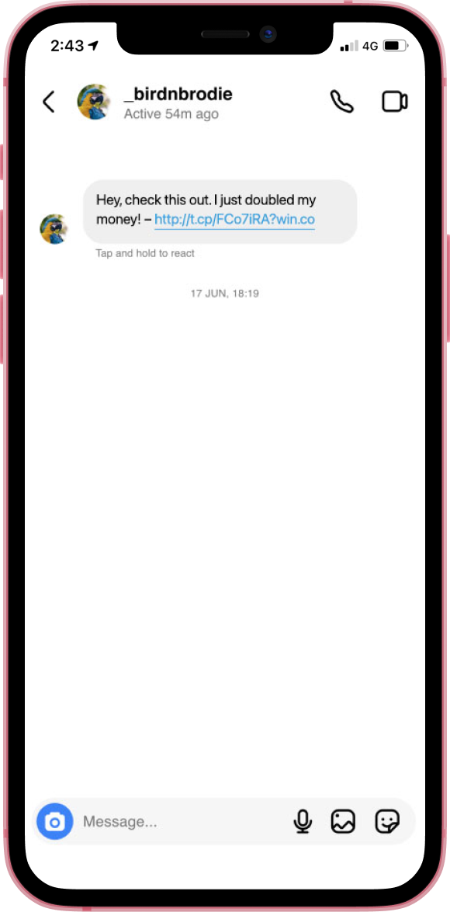

# Phishing

Phishing is a means that cyber criminals use to trick you into giving them personal information, this can be performed over email, messages, social media and any other means of communication. In many cases it can be challenging to spot and even come from someone you know online.

## How to spot it

There are usually some telltale signs around any Phishing attack these include:

<ul>
    <li>The senders name: often the username of the sender will have some slight changes such as an underscore instead of a space or number such as a 0 instead of an o</li>
    <li>The senders @domain: a fake email which pretends to be from a large company or government will usually have a standard domain such as @gmail.com instead of the business name or gov at the end</li>
    <li>Unusual links or link shorteners: the above points also apply to links contained within the message, most often legitimate emails will tell you to visit their website rather than send you a link</li>
    <li>Offers that seem to good to be real: they probably are, often these offers will also have a limited time to cause the victim to hurry and not analyse it to check if it's a scam first</li>
    <li>Current events: often scammers will send messages based of current events taking place, such as around tax time a scammer would send emails to scam people pretending to be from the government</li>
    <li>Zip attachments: often scammer can hide malicious files inside of a zip</li>
</ul>

## What to do

There will usually be a means of reporting and blocking accounts for these kinds of actions. Reporting the account will usually end up with the account removed from the platform, and following this preventative measures are often enforced by your provider to prevent these bad actors from registering new accounts.

Blocking the user will prevent them from sending you further phishing scams under this username.

# Scam calls (i needed more things to write about)

You hare probably heard about scam calls before, they are phone calls made by a scammer that pretends to be from an organisation with some kind of problem involving payment or your computer. Most often these calls are aimed at elderly people or people with little knowledge about technology. These scams can be highly sophisticated to try to keep their anonymity while having their victim not become too suspicious of what's happening.

These scams often involve a desktop or laptop, where a scammer will most likely ask you to install some form of remote desktop software. This software allows them to have full remote access over your computer.

The following info aims to help you avoid being scammed by telling to common actions of scammers you need to be aware of.

## How the scammer scams

Note: this is primarily for tech support scams however the general process will be similar for other kinds of scams

<ol>
    <li>Fear and urgency: A scammer will attempt to create a sense of urgency, telling their victim that their computer is in dire need of fixes and will leak their personal information if left unchecked</li>
    <li>Offer to fix the issue: A scammer then will proceed to say that they need access to the victim's computer to solve the issue</li>
    <li>Exaggerate the nonexistent issue: Make out that the situation is worse than originally thought. This is often done by entering "netstat" into a command prompt window, this command outputs merely statistics about your computer's network connection, however a scammer would make out that the list of connections are from "hackers". A scammer may also say other core processes on your computer are malware.</li>
    <li>Request payment: The next step a scammer will take once they have their victim convinced that their computer needs urgent fixes, is to request a payment for their "services". Since they have remote access to your computer they will open up a form in your browser, where they request your personal info.</li>
    <li>The scam: most often after personal information has been stolen the scammer will simply disappear, leaving the call. However they may sometimes modify bank account balances to trick the victim into transferring even more money to the scammer.</li>
</ol>

Overall, scams are a hazard to many people who know little about computers and how they work, they manipulate this vulnerability to profiteer.

If you wish to learn more about the types of scams, there is plenty of information online about it.

# other

## refrences

Wikipedia Contributors. “Technical Support Scam.” Wikipedia, Wikimedia Foundation, 17 Dec. 2019, en.wikipedia.org/wiki/Technical_support_scam

### images

social media scam: https://www.cyber.gov.au/learn-basics/explore-basics/recognise-and-report-scams

https://cheapsslsecurity.com/blog/10-phishing-email-examples-you-need-to-see/

https://www.smh.com.au/national/bombarded-with-scam-calls-and-messages-there-s-a-way-to-stop-them-20231219-p5eshi.html